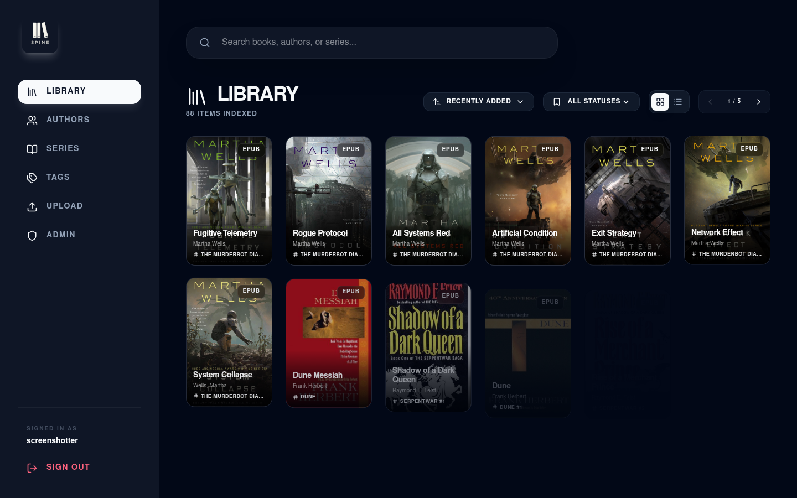
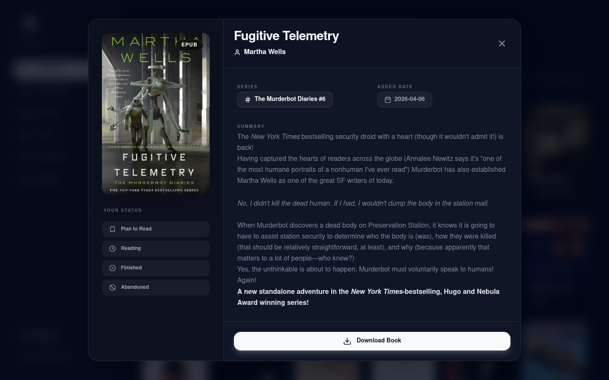
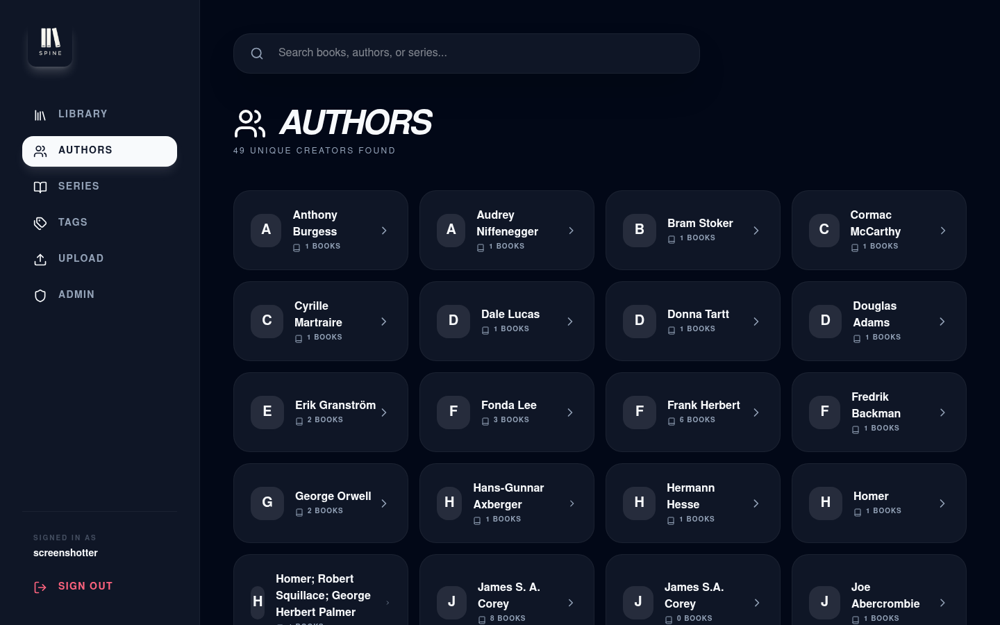
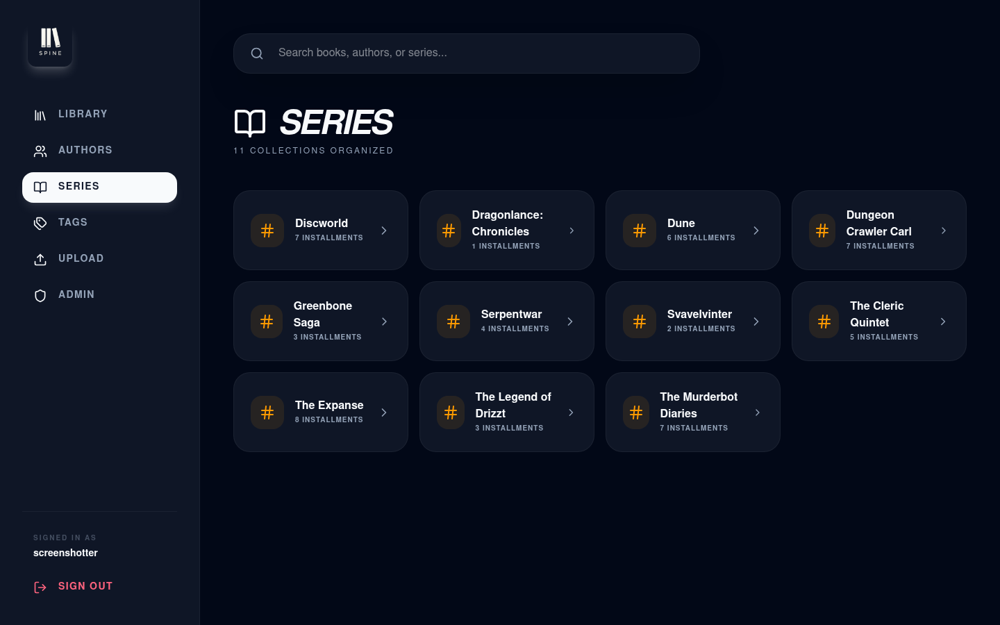
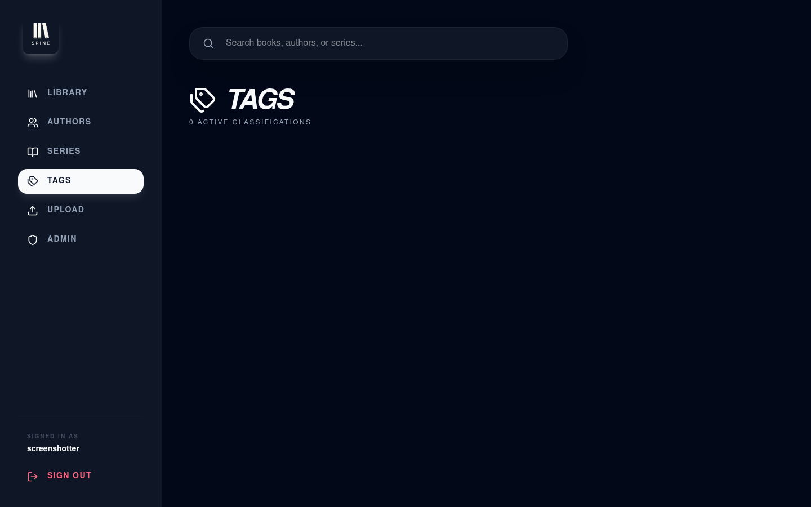
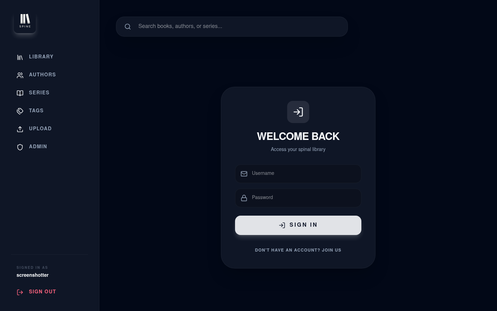
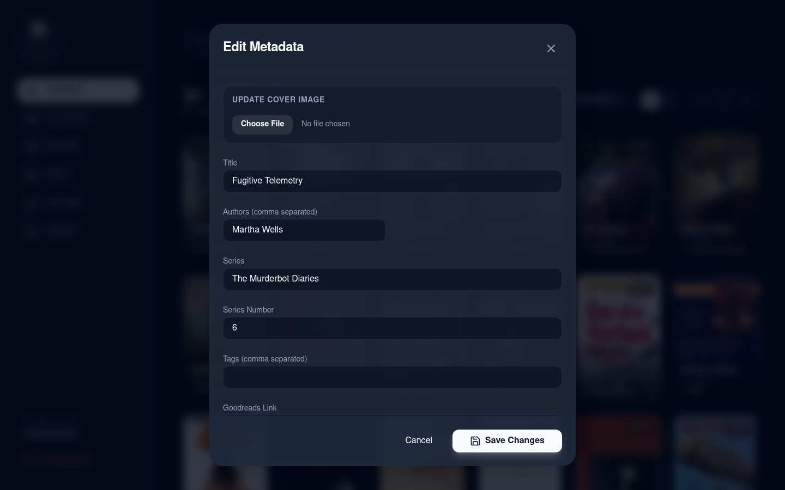

# Spine

A self-hosted ebook library with a clean dark UI, OPDS support, and user management.



## Features

- Automatic metadata and cover extraction from EPUB and PDF files
- Browse by author, series, or tag
- Reading status tracking (Plan to Read / Reading / Finished / Abandoned)
- Reviews and star ratings
- Custom shelves
- Full-text search across title, author, and series
- Metadata editor with autocomplete for authors and series
- OPDS catalog feed for use with ebook reader apps (Moonreader, KOReader, Kybook, etc.)
- Multi-user with admin approval flow
- JWT authentication with 30-day tokens and silent refresh

---

## Screenshots

| | |
|---|---|
|  |  |
| **Library** — grid view with cover art | **Book detail** — summary, reading status, reviews |
|  |  |
| **Authors** | **Series** |
|  |  |
| **Tags** | **Upload** |
|  | |
| **Metadata editor** — with author/series autocomplete | |

---

## Quick Start with Docker

```bash
git clone https://github.com/ulve/spine
cd spine
cp .env.example .env          # edit JWT_SECRET at minimum
mkdir -p books data
docker compose up --build
```

Open [http://localhost:3000](http://localhost:3000). The first account you register becomes admin.

Drop `.epub` or `.pdf` files into the `books/` folder — they are picked up automatically.

---

## Environment Variables

| Variable | Default | Description |
|---|---|---|
| `JWT_SECRET` | **required** | Secret used to sign tokens. Use a long random string. |
| `DATABASE_URL` | `file:./dev.db` | SQLite database path. In Docker use `file:/app/data/app.db`. |
| `PORT` | `3000` | Port the server listens on. |
| `BOOKS_DIR` | `/app/books` | Directory scanned for ebook files. |
| `COVERS_DIR` | `/app/data/covers` | Directory where extracted cover images are stored. |
| `BASE_URL` | auto-detected | Override for OPDS feed links (e.g. `https://books.example.com`). |
| `ALLOWED_ORIGINS` | *(all)* | Comma-separated list of allowed CORS origins. Leave unset for self-hosted single-origin setups. |

---

## Local Development

**Prerequisites:** Node.js 20+, GraphicsMagick and Ghostscript (for PDF cover extraction)

```bash
npm install
cd frontend && npm install && cd ..
npx prisma generate
npx prisma db push
```

Start the backend (port 3000):

```bash
npm run start
```

Start the Vite dev server in a separate terminal (port 5173, proxies API to 3000):

```bash
cd frontend
npm run dev
```

---

## How It Works

### Book ingestion

Files placed in `BOOKS_DIR` are scanned on startup and watched for changes. For each file:

- **EPUB** — metadata (title, author, description) and cover art are read from the EPUB manifest.
- **PDF** — title and author are read from the PDF metadata; the first page is rendered as a cover image using `pdf2pic`.

If a book already exists in the database and already has a cover and description, it is skipped on subsequent scans.

### Authentication

1. Register at `/login`. The first account is automatically admin and approved.
2. Later accounts must be approved by an admin via the Admin panel.
3. Login returns a JWT (30-day expiry). The frontend silently refreshes it when less than 24 hours remain.
4. Admin-only actions: upload, cover replacement, metadata editing, user management.

### OPDS

The catalog is available at `/opds`. It provides:

- `/opds` — navigation root
- `/opds/recent` — recently added (paginated, 30 per page)
- `/opds/authors` — all authors
- `/opds/authors/:id` — books by author (paginated)
- `/opds/series` — all series
- `/opds/series/:id` — books in series (paginated)
- `/opds/tags` — all tags
- `/opds/tags/:id` — books by tag (paginated)

OPDS is currently public (no authentication required). To add auth, place a reverse proxy in front of `/opds` and `/api/download` with HTTP Basic authentication backed by the same user table.

---

## API Reference

### Public

| Method | Path | Description |
|---|---|---|
| `GET` | `/api/books` | List books. Supports `q`, `authorId`, `seriesId`, `tagId`, `sortBy`, `sortOrder`, `page`, `limit`. |
| `GET` | `/api/books/:id` | Get a single book. |
| `GET` | `/api/books/:id/reviews` | Get reviews for a book. |
| `GET` | `/api/authors` | List all authors. |
| `GET` | `/api/series` | List all series. |
| `GET` | `/api/tags` | List all tags. |
| `GET` | `/api/download/:id` | Download a book file. |
| `POST` | `/api/auth/register` | Register a new account. |
| `POST` | `/api/auth/login` | Log in. Returns `{ token, user }`. |
| `POST` | `/api/auth/refresh` | Exchange a valid token for a new one (Bearer auth required). |

### Authenticated

| Method | Path | Description |
|---|---|---|
| `POST` | `/api/books/:id/status` | Set reading status (`PLAN_TO_READ`, `READING`, `FINISHED`, `ABANDONED`) and progress. |
| `DELETE` | `/api/books/:id/status` | Remove reading status. |
| `POST` | `/api/books/:id/review` | Submit or update a review (rating 1–5, optional comment). |
| `GET` | `/api/shelves` | List your shelves. |
| `POST` | `/api/shelves` | Create a shelf. |
| `POST` | `/api/shelves/:id/books/:bookId` | Add a book to a shelf. |
| `DELETE` | `/api/shelves/:id/books/:bookId` | Remove a book from a shelf. |

### Admin only

| Method | Path | Description |
|---|---|---|
| `GET` | `/api/admin/users` | List all users. |
| `POST` | `/api/admin/users/:id/approve` | Approve a pending user. |
| `DELETE` | `/api/admin/users/:id` | Delete a user (cannot delete the last admin). |
| `POST` | `/api/upload` | Upload one or more `.epub` or `.pdf` files. |
| `POST` | `/api/books/:id/cover` | Replace the cover image. Set `embed=true` to embed in the EPUB file. |
| `PATCH` | `/api/books/:id` | Update metadata (title, authors, series, seriesNumber, tags, description, goodreadsLink). |

---

## Taking Screenshots

A Playwright script is included to regenerate the screenshots:

```bash
# Requires a running Spine instance with books
BASE_URL=http://localhost:3000 \
SPINE_USER=admin \
SPINE_PASS=yourpassword \
node scripts/screenshots.mjs
```

Output goes to `screenshots/`.

---

## Project Structure

```
spine/
├── src/                  # Backend (Node/Express/Prisma)
│   ├── api/
│   │   ├── auth.ts       # Auth routes and middleware
│   │   ├── opds.ts       # OPDS catalog feed
│   │   ├── routes.ts     # REST API routes
│   │   └── validation.ts # Input validation helpers
│   ├── scanner/
│   │   └── ScannerService.ts  # File watcher and metadata extractor
│   ├── config.ts
│   ├── db.ts
│   └── index.ts          # Express app entry point
├── frontend/             # Vite/React frontend
│   └── src/
│       ├── components/   # BookCard, BookDetailModal, MetadataEditor, Layout
│       ├── contexts/     # AuthContext
│       ├── lib/          # apiClient, utils
│       ├── pages/        # LibraryPage, AuthorsPage, SeriesPage, TagsPage, UploadPage, etc.
│       └── types/        # Shared TypeScript types
├── prisma/
│   ├── schema.prisma
│   └── migrations/
├── scripts/
│   └── screenshots.mjs
├── screenshots/          # Generated screenshots
├── Dockerfile
├── docker-compose.yml
└── package.json
```
